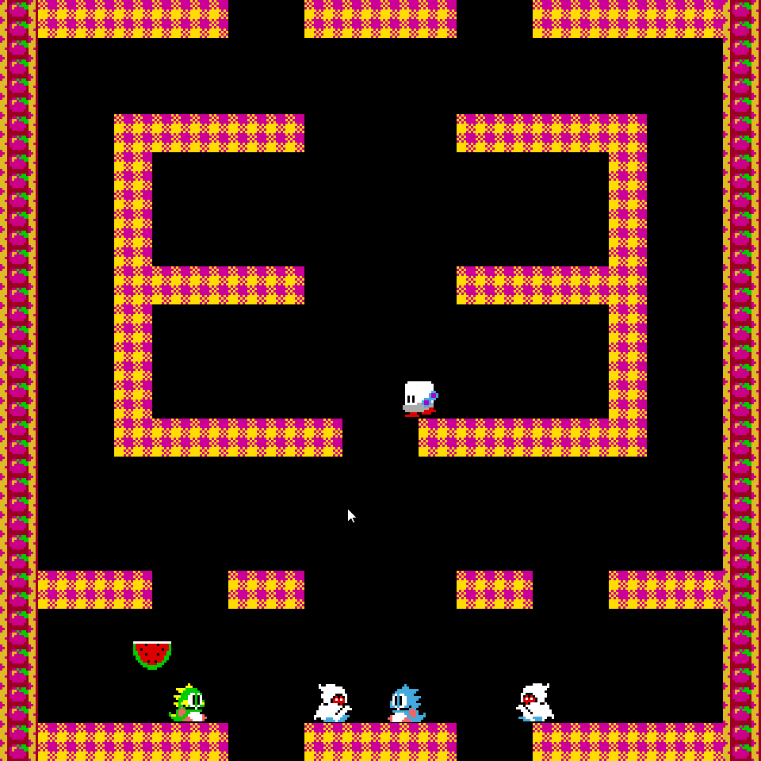

## Benchine

Benchine is a small 2D Game engine using 
- OpenGL
- [Dear ImGui](https://github.com/ocornut/imgui)
- [GLM](https://glm.g-truc.net/)
- XINPUT
- Component system.

### Bubble Bobble

Benchine was used to implement bubble bobble.

[Github link](https://github.com/DatTestBench/Benchine)

 

[<- Back](../index.md)