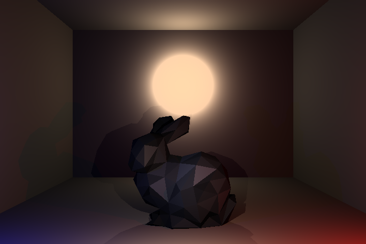
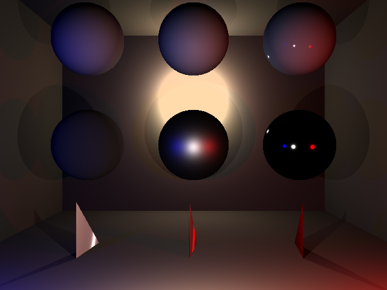

## Software Raytracer

A work in progress software raytracer written in C++, using GLM, and allowing for PBR materials.

Some of the libraries used for this project:
- [glm](https://glm.g-truc.net/0.9.9/index.html) (math library)
- [SDL2](https://www.libsdl.org/) (program window)
- [vld](https://kinddragon.github.io/vld/) (memory leak detection)

[Project Repository](https://github.com/DatTestBench/SoftwareRaytracer)

 

[<- Back](../index.md)

