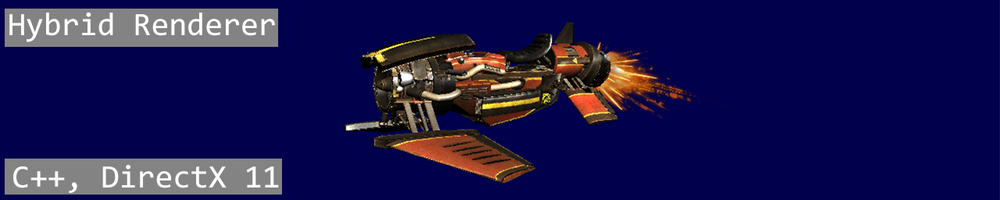
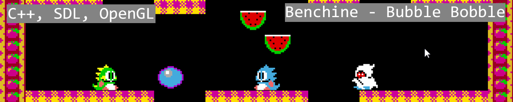
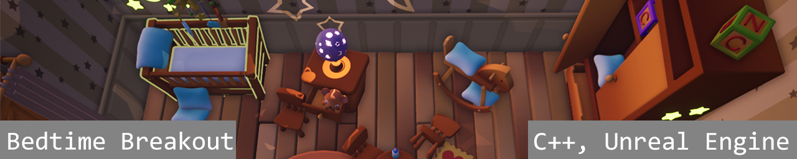
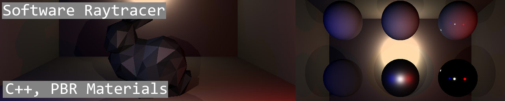

 
A hybrid rasterized renderer written in C++, that allows switching between software, and hardware-accelerated DirectX 11 render modes. 
[more...](Pages/HybridRenderer.md) 
 
 

 
2D OpenGL game engine made in C++. Used to remake Bubble Bobble. 
[more...](Pages/Benchine.md) 
 
 

 
A 4 player couch co-op tag game. 
[more...](Pages/BedtimeBreakout.md) 
 
 

 
A work in progress software raytracer written in C++, with PBR support. 
[more...](Pages/SoftwareRaytracer.md) 
 
 

## About me 

My name is Matthieu Limelette. I'm a Belgian 3rd year Game Development student at Digital Arts & Entertainment.

I've always been interested in games. First by playing them, and later by wanting to know how they worked, and now finally, getting to learn how to make them!
I'm especially interested in game engines and graphics.

## Contact
- [matthieu.limelette@gmail.com](matthieu.limelette@gmail.com)
- [Linkedin](https://www.linkedin.com/in/matthieu-limelette-ab98501b8/)